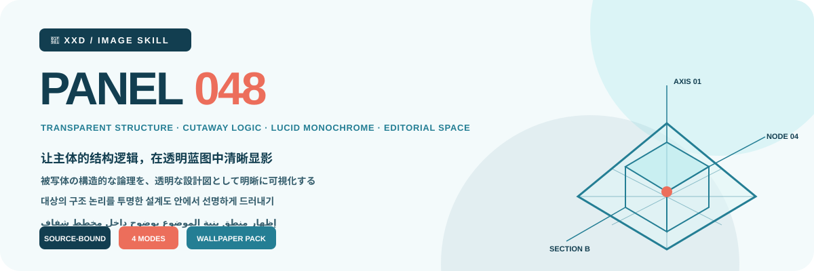
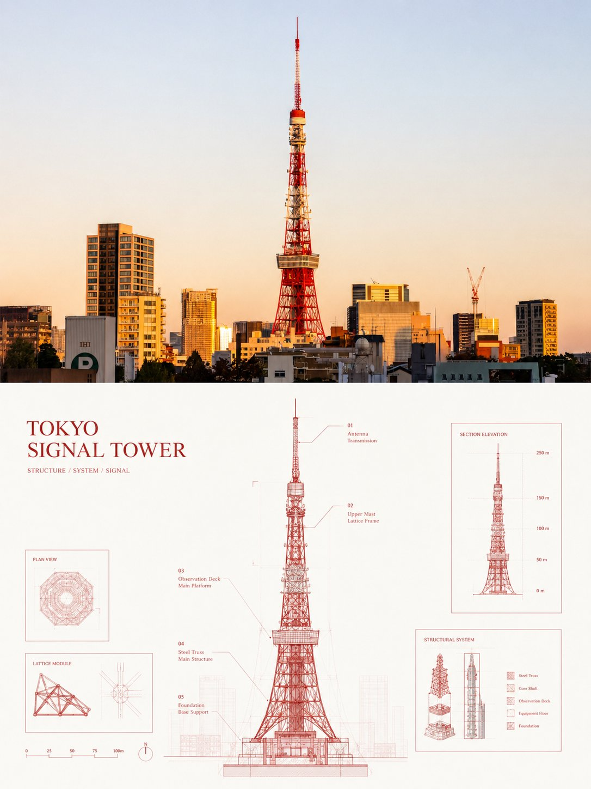
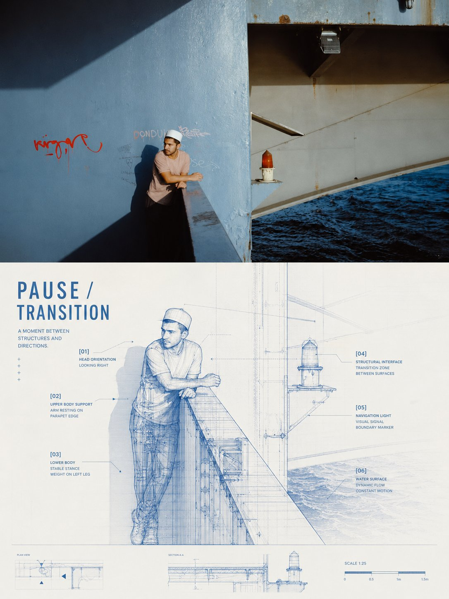
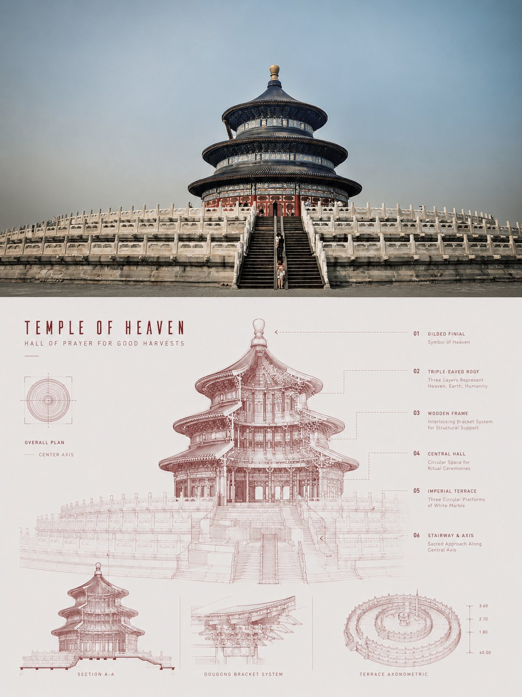
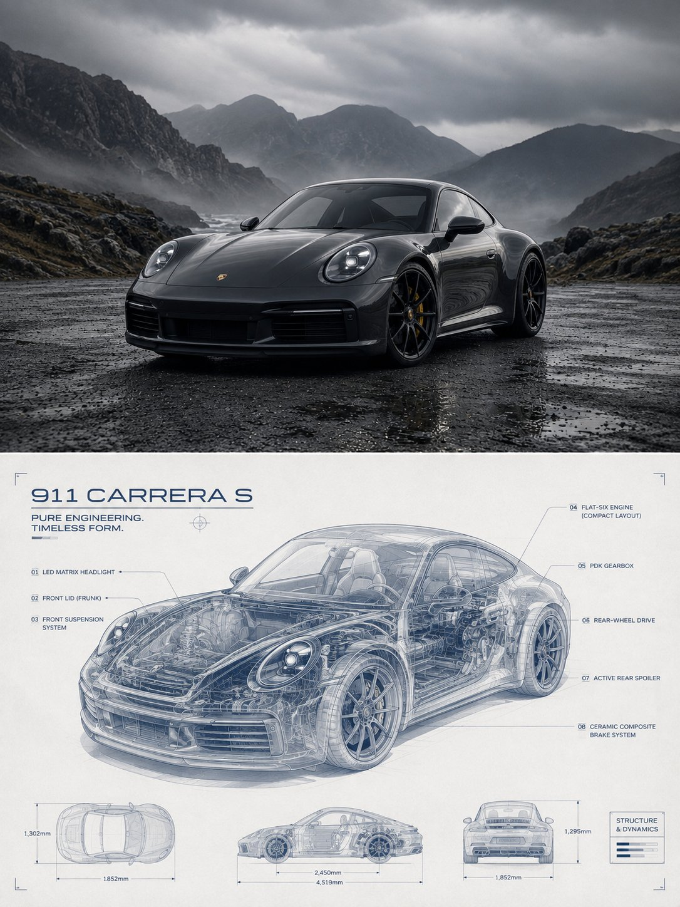

<p align="center"></p>

<div align="center">

# 🦁 XXD Panel 048

### Reveal the subject's structural logic through a transparent blueprint

[简体中文](README.md) · **English** · [日本語](README.ja.md) · [한국어](README.ko.md) · [العربية](README.ar.md)

</div>

> TRANSPARENT STRUCTURE · SCIENTIFIC ILLUSTRATION · LUCID MONOCHROME · PRECISE ANNOTATION · EDITORIAL SPACE

XXD Panel 048 turns the recognisable subject into a structural blueprint between engineering drawing, X-ray transparency, scientific illustration, and a future archive. It never piles on generic machinery: objects reveal components, buildings reveal spaces, vehicles reveal propulsion, plants reveal growth, and people or animals reveal pose, motion, or clothing layers.

## Aesthetic motive

```text
lock identity, contour, pose, and relation → preserve three cues → decide what “inside” means for this subject → reveal selective cuts and transparent layers → organise axes, dimensions, nodes, and leaders into one reading path → derive a lucid monochrome from the source → keep generous space → bind copy to exact structures
```

- The contour remains immediately recognisable; every internal structure needs subject-specific evidence.
- Transparency, sections, exploded details, and magnification explain only meaningful information.
- Use a light ground, one source-derived line colour, and limited tonal steps; blue is never an automatic default.
- Reject ordinary tracing, anatomical gore, arbitrary machinery, dense HUDs, neon cyberpunk, and pseudo-technical text.

Full specifications: [Skill](SKILL.md) · [source brief](references/048-source.md) · [English production prompt](references/xxd-panel-048-prompt.en.md) · [Chinese production prompt](references/xxd-panel-048-prompt.zh-CN.md)

## Samples · From X

> [Xiaoxiaodong (@xiaoxiaodong01)](https://x.com/xiaoxiaodong01/status/2091374796517130282) · 23 August 2026<br>
> GPT2 × blueprint × structural breakdown × aesthetic prompt × VOL.048

<table>
  <tr>
    <td width="50%"><a href="https://x.com/xiaoxiaodong01/status/2091374796517130282"></a></td>
    <td width="50%"><a href="https://x.com/xiaoxiaodong01/status/2091374796517130282"></a></td>
  </tr>
  <tr>
    <td width="50%"><a href="https://x.com/xiaoxiaodong01/status/2091374796517130282"></a></td>
    <td width="50%"><a href="https://x.com/xiaoxiaodong01/status/2091374796517130282"></a></td>
  </tr>
</table>

<p align="center"><a href="https://x.com/xiaoxiaodong01/status/2091374796517130282">View the original post and full prompt →</a></p>

These samples demonstrate the 048 aesthetic motive. Their subjects, composition, palette, copy, and earlier canvas ratio never become generation references or current defaults.

## Four combinable output modes

Choose one or several modes with `1`, `1+3`, `1,2,4`, or `all`; `all` produces seven separate PNGs per source. After mode selection and before generation, the Skill explicitly asks for the whole finished canvas: the original-prompt `3:4`, an explicit source-aspect choice, a common ratio, or custom ratio/exact pixels. Source dimensions are never applied silently.

| Mode | Canvas rule | Result |
| --- | --- | --- |
| `top-bottom` | user-confirmed whole canvas | one complete generation: high-fidelity source above, 048 design below, approximately 50/50 |
| `left-right` | user-confirmed whole canvas | one complete generation: high-fidelity source left, 048 design right, approximately 50/50 |
| `design-only` | user-confirmed whole canvas | 048 design fills the canvas; source remains invisible |
| `wallpaper-pack` | confirmed per device | separate phone, iPad, desktop, and children's-watch PNGs |

Paired modes use the source as a high-fidelity edit/reference input and one complete style prompt to generate the finished composition directly, so photography, design, colour, light, typography, and meaning can cohere. Deterministic composition is fallback-only: after one targeted complete-canvas retry fails, when pixel-identical source preservation is explicitly required, when the active route cannot realise the canvas, or for lossless final pixel calibration.

Wallpapers may be linked or independent. A linked pack approves one iPad anchor, then recomposes every other device from the original plus that same anchor. An independent pack gives each device only the original. Neither crops another device output nor chains derivatives.

## Copy, locale, and output

Before generation, resolve automatic copy, exact custom copy, or text-free output, and independently confirm the target language or locale. Automatic copy is one concise identity-, function-, action-, or meaning-bound title with only necessary technical notes. Exact user copy remains verbatim. Ordinary sizes adapt to the source; all deliverables are PNGs in a fresh `~/Desktop/xxd/xxd-panel-048/<fresh-task>/` directory.

## Install

```bash
git clone https://github.com/nevertoday/xxd-panel-048.git
mkdir -p ~/.codex/skills
ln -s "$(pwd)/xxd-panel-048" ~/.codex/skills/xxd-panel-048
```

Claude Code users may link the folder under `~/.claude/skills/xxd-panel-048`. Restart the agent session and invoke `$xxd-panel-048`.

## About and support

XXD abbreviates Xiaoxiaodong's brand name. Created and maintained by [@xiaoxiaodong01](https://x.com/xiaoxiaodong01). In-depth consultation is CNY 299/hour. The Skills User Community is a CNY 99 one-time fee. Knowledge Planet + Member Prompt Library is one CNY 699/year payment for both benefits: after joining [Knowledge Planet](https://wx.zsxq.com/group/15554814142882), contact Xiaoxiaodong on WeChat for a [Member Prompt Library](https://vip.xiaoxiaodong.ai/) redemption code; after self-service activation in the prompt library, contact Xiaoxiaodong on WeChat for an invitation to Knowledge Planet. [WeChat](https://xiaoxiaodong.pages.dev/assets/wechat-qr.png)

<p align="center"><a href="https://xiaoxiaodong.pages.dev/assets/wechat-qr.png"></a></p>

<div align="center">

## ☕ Support this open-source project

Support is optional and never changes open-source access.

<a href="https://github.com/nevertoday/zhongguo-traditional-colors/blob/main/docs/images/buy-me-a-coffee-qr.png?raw=true"></a>

</div>
